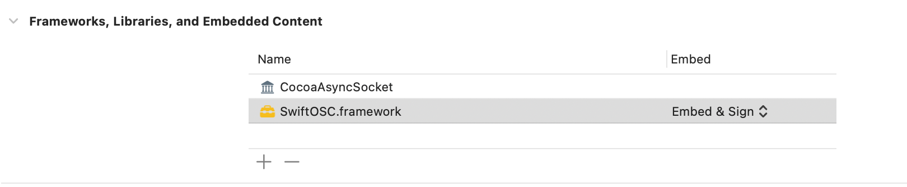

# iPhone Gyroscope Data to Max/MSP via UDP (Max for Live Integration)

This project allows you to send real-time gyroscope data from an iPhone to Max/MSP via UDP. The data is transmitted wirelessly and can be used to control parameters in Max/MSP or Max for Live devices (e.g. synthesizer) in Ableton Live.

## Features

- **Real-Time Gyroscope Data**: Captures gyroscope data from the iPhone (x, y, z rotation rates) at a frequency of 1 Hz.
- **UDP Communication**: Sends the gyroscope data over UDP to a specified IP address and port (Max/MSP or Max for Live).
- **Max/MSP Integration**: Uses the `udpreceive` object to receive and process the gyroscope data in Max/MSP.
- **Max for Live Support**: Fully compatible with Ableton Live, allowing the control of Live parameters using the iPhone's gyroscope data.
  
## Requirements

- **iPhone** with iOS 14 or later
- **Xcode** for building the iOS app
- **Ableton Live**  with Max for Live support
- **swiftOSC** library for OSC communication

## How It Works

1. **iOS App**: The iPhone app captures real-time gyroscope data using the `CMMotionManager` and sends it over UDP to a specified Max/MSP or Max for Live device using the `swiftOSC` library.
2. **Max/MSP or Max for Live**: The Max patch uses the `udpreceive` object to listen for incoming UDP messages containing the gyroscope data. These values can be routed to control any Max/MSP parameters or effects in Ableton Live.
3. **Data Format**: The data is sent as a message in the format `"/gyro x_value y_value z_value"`, where `x_value`, `y_value`, and `z_value` represent the gyroscope's rotation rates around the three axes.

## Setup Instructions

### iOS Setup

#### 1. Adding Dependencies

[SwictOSC]: https://github.com/ExistentialAudio/SwiftOSC

- Clone or download the both reposit.
- Open the `Max-Gyro` project in Xcode and navigate to frame work.

click "+" and add workspace from SwiftOSC as other files

click "+" again to add framework

#### 2. Build and run the app on iOS device.

- Ensure your app's bundle identifier and team settings are configured for deployment.
- Set IP address and port. Set data update interval.

###  Network Configuration

- **IP Address**: Ensure that both the iOS device and the computer running Max/MSP (or Ableton Live) are on the same local network.
- **Firewall Settings**: Make sure that UDP traffic on the selected port (default is 12345) is not blocked by any firewall.

### Max/MSP or Max for Live

1. Drag&Drop m4l device to Ableton as audio effects.

2. Type in port number to receive and process the UDP data:
    
3. Click MAP to use the unpacked `x`, `y`, and `z` values to control any parameters within Ableton, such as synth knobs or audio effects. Adjust modulation range. Click "X" to unmap.

- Modulation amount changes with the rotation of the device.
